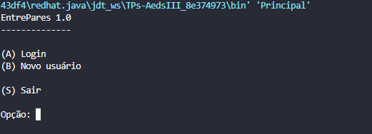
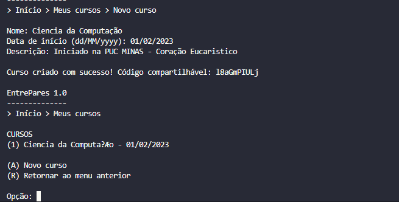
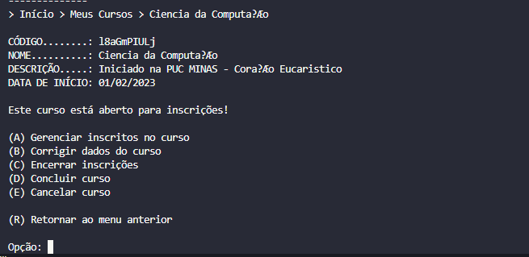
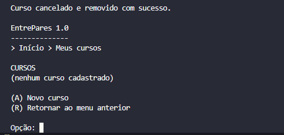

# Relatório — TP1 (AEDs III) — **EntrePares 1.0**

## Sumário

1. [Participantes](#1-participantes)  
2. [Descrição do sistema](#2-descrição-do-sistema)  
3. [Telas (capturas) e classes relacionadas](#3-telas-capturas-e-classes-relacionadas)  
4. [Classes criadas (por pacote)](#4-classes-criadas-por-pacote)  
5. [Operações especiais implementadas](#5-operações-especiais-implementadas)  
6. [Vídeo de demonstração](#6-vídeo-de-demonstração)  
7. [Checklist do enunciado (Sim/Não)](#7-checklist-do-enunciado-simnão)  
8. [Como compilar e executar](#8-como-compilar-e-executar)

---

## 1. Participantes

| Nome |
|------|
| Paulo Gabriel de Oliveira Leite |
| Samuel Lucas Rodrigues Vieira |
| Carlos Eduardo de Melo Sabino |
| Rubens Dias Bicalho |

---

## 2. Descrição do sistema

O **EntrePares 1.0** é um sistema em **Java (console)** para **gerenciamento de cursos de estudo em pares**. Cada usuário pode se cadastrar, autenticar-se e **criar, listar, alterar e remover** cursos de sua autoria, com regras de negócio sobre estados do curso e consistência dos dados.

A persistência apoia-se na infraestrutura do pacote `aed3` (**CRUD genérico** com **índice direto** por ID via **Tabela Hash Extensível**, além de **Árvore B+** onde aplicável). A aplicação segue o padrão **MVC**, com camadas em `modelo`, `visao` e `controle`, conforme recomendação do **Prof. Marcos Kutova**.

### 2.1. Principais funcionalidades

- **Cadastro de usuário:** nome, e-mail único, senha (armazenada como hash **SHA-256**), pergunta secreta e resposta secreta (resposta também em hash).
- **Login** por e-mail e senha, usando **Tabela Hash Extensível** para localizar o usuário de forma eficiente.
- **Recuperação de senha:** exibe a pergunta secreta cadastrada; se a resposta conferir, permite definir nova senha.
- **Alteração dos dados do usuário**, incluindo troca de e-mail com validação de unicidade e troca de senha.
- **Exclusão de usuário:** bloqueada quando ainda existem cursos **ativos** (estado `0` ou `1`); cursos já concluídos/cancelados podem ser removidos em **cascata** antes da exclusão.
- **Criação de curso:** nome, data de início, descrição e **código compartilhável** único (gerado automaticamente e validado via hash extensível).
- **Listagem dos cursos do usuário logado**, em **ordem alfabética** (com critérios de desempate), obtida a partir dos identificadores retornados pela **Árvore B+** que modela o relacionamento **1:N** entre usuários e cursos (código-base da disciplina).
- **Atualização dos dados do curso** (nome, data, descrição).
- **Transições de estado do curso:**
  - `0` → `1`: encerrar inscrições;
  - `0` ou `1` → `2`: concluir curso;
  - **Cancelar curso:** como inscrições ainda não estão no escopo do TP1, o cancelamento **remove o curso fisicamente** do armazenamento.
- **Breadcrumbs** em todas as telas, no formato `Início > Meus Cursos > Nome do Curso`.

---

## 3. Telas (capturas) e classes relacionadas

As imagens devem ficar na pasta `docs/` (caminhos relativos à raiz do repositório). Abaixo, cada tela está associada às **classes de visão/controle** que concentram a interação exibida.

| # | Descrição da tela | Arquivo da captura | Classes mais diretamente envolvidas |
|---|-------------------|--------------------|-------------------------------------|
| 1 | Tela inicial (login / novo usuário / sair) | `docs/tela-inicial.png` | `Principal`, `VisaoUsuario` |
| 2 | Fluxo de login | `docs/login-usuario.png` | `VisaoUsuario`, `ControleUsuario`, `ArquivoUsuario` |
| 3 | Listagem **Meus Cursos** + criação de curso (código gerado) | `docs/cursos.png` | `VisaoCurso`, `ControleCurso`, `ArquivoCurso` |
| 4 | Curso selecionado (ações: encerrar inscrições / concluir / cancelar) | `docs/informacoes-cursos.png` | `VisaoCurso`, `ControleCurso`, `ArquivoCurso` |
| 5 | Cancelamento de curso | `docs/cancelamento-curso.png` | `VisaoCurso`, `ControleCurso`, `ArquivoCurso` |

### Pré-visualização (mesmas imagens do relatório anterior)

1. **Tela inicial (Login / Novo usuário / Sair).**  
   

2. **Login do usuário.**  
   

3. **Listagem de "Meus Cursos" ordenada por nome e criação de curso com código compartilhável gerado.**  
   

4. **Tela de um curso selecionado com opções de encerrar inscrições / concluir / cancelar.**  
   

5. **Cancelamento de um curso.**  
   

---

## 4. Classes criadas (por pacote)

O projeto está organizado em quatro áreas principais: infraestrutura `aed3`, entidades e arquivos em `modelo`, telas em `visao`, regras em `controle`, além da classe `Principal`.

### 4.1. Pacote `aed3` — infraestrutura de persistência

Adaptações do código-base da disciplina (repositório AEDs III / material do Prof. Kutova: CRUD genérico, Tabela Hash Extensível e Árvore B+).

| Classe | Papel |
|--------|--------|
| `Registro` | Interface dos objetos armazenáveis no arquivo (ID + serialização). |
| `RegistroHashExtensivel` | Interface dos pares armazenáveis na hash extensível. |
| `RegistroArvoreBMais` | Interface dos pares armazenáveis na Árvore B+. |
| `Arquivo<T>` | CRUD genérico com cabeçalho, lista de registros excluídos e **índice direto por ID** (hash extensível de `ParIDEndereco`). |
| `HashExtensivel<T>` | Tabela Hash Extensível com diretório dinâmico e duplicação por profundidade. |
| `ArvoreBMais<T>` | Árvore B+ genérica com folhas encadeadas; suporta consulta por prefixo (“coringa”). |
| `ParIDEndereco` | Par (ID, endereço em bytes) usado pelo índice direto do `Arquivo`. |

### 4.2. Pacote `modelo` — entidades e pares de índice

| Classe | Papel |
|--------|--------|
| `Usuario` | Entidade do usuário (id, nome, email, hash da senha, pergunta secreta, hash da resposta). |
| `Curso` | Entidade do curso (id, nome, data de início, descrição, código compartilhável, estado, **idUsuario**). |
| `ParEmailID` | Par para índice hash `email → idUsuario` (tamanho fixo de 124 bytes). |
| `ParCodigoCursoID` | Par para índice hash `codigoCompartilhavel → idCurso`. |
| `ParIntInt` | Par `(idUsuario, idCurso)` na Árvore B+ do **1:N**. O `compareTo` trata `-1` no segundo campo como coringa, permitindo `read(new ParIntInt(idUsuario, -1))` retornar todos os cursos do usuário. |
| `ParNomeIDCurso` | Par `(nomeCurso, idCurso)` na Árvore B+ que mantém ordenação alfabética (atualizada no CRUD; útil para extensões). |
| `ArquivoUsuario` | Estende `Arquivo<Usuario>`. Mantém `indiceEmail: HashExtensivel<ParEmailID>` para unicidade e busca por e-mail. |
| `ArquivoCurso` | Estende `Arquivo<Curso>`. Índices: `indiceCodigo` (hash), `indiceUsuarioCurso: ArvoreBMais<ParIntInt>` (**1:N**), `indiceNomeCurso: ArvoreBMais<ParNomeIDCurso>` (nome). |

### 4.3. Pacote `visao` — telas (console)

| Classe | Papel |
|--------|--------|
| `VisaoUsuario` | Cadastro, login, recuperação de senha, alteração e exclusão de usuário. |
| `VisaoCurso` | Listagem, criação, edição, menu do curso selecionado, breadcrumbs. |

### 4.4. Pacote `controle` — regras de negócio

| Classe | Papel |
|--------|--------|
| `ControleUsuario` | Orquestra cadastro, login, recuperação de senha e exclusão (restrições de cursos ativos). |
| `ControleCurso` | Orquestra CRUD e transições de estado; aplica listagem ordenada por nome. |

### 4.5. Classe raiz

| Classe | Papel |
|--------|--------|
| `Principal` | Ponto de entrada; instancia `ArquivoUsuario` / `ArquivoCurso`, sessão e encerramento dos recursos. |

---

## 5. Operações especiais implementadas

1. **Consulta 1:N via Árvore B+ com chave parcial:** `indiceUsuarioCurso.read(new ParIntInt(idUsuario, -1))` usa o `compareTo` de `ParIntInt` (coringa no segundo campo) para obter todos os pares `(idUsuario, idCurso)` sem varredura linear do arquivo principal.
2. **Listagem alfabética dos cursos do usuário:** a partir dos IDs do índice 1:N, os registros são lidos e ordenados na camada de arquivo/listagem (com desempate por data e ID), e a `VisaoCurso` exibe numeração sequencial. O índice `indiceNomeCurso` permanece sincronizado nas operações de CRUD para evoluções futuras.
3. **Código compartilhável único:** geração aleatória com verificação de colisão em **O(1)** amorteizado via `indiceCodigo: HashExtensivel<ParCodigoCursoID>`.
4. **Unicidade de e-mail:** `create` e `update` em `ArquivoUsuario` consultam `indiceEmail` antes de gravar; e-mails são normalizados (trim + minúsculas).
5. **Hash SHA-256** de senha e de resposta secreta; recuperação compara hashes, sem armazenar texto claro.
6. **Exclusão em cascata controlada:** `usuarioPossuiCursoAtivo` impede exclusão do usuário com curso em estado `0` ou `1`; caso contrário, `excluirTodosCursosDoUsuario` remove cursos remanescentes antes de apagar o usuário, mantendo índices consistentes.
7. **Transições de estado:** `alterarEstado` em `ArquivoCurso` centraliza mudanças válidas de estado do curso.
8. **Sincronização de índices:** sobrescritas de `create`, `update` e `delete` em `ArquivoUsuario` e `ArquivoCurso` propagam alterações a **todos** os índices (hash e B+) envolvidos.

---

## 6. Vídeo de demonstração

- **Link:** *A preencher pelo grupo.*

---

## 7. Checklists

---

### 1)

**Há um CRUD de usuários (que estende a classe ArquivoIndexado, acrescentando Tabelas Hash Extensíveis e Árvores B+ como índices diretos e indiretos conforme necessidade) que funciona corretamente?**

- [x] **Resposta:** **Sim**
- **Justificativa:** A classe `modelo.ArquivoUsuario` estende `aed3.Arquivo<Usuario>` (CRUD indexado: o `Arquivo` já mantém **índice direto por ID** com **Hash Extensível** internamente) e acrescenta o índice indireto `indiceEmail: HashExtensivel<ParEmailID>` para unicidade de e-mail e login. Os fluxos de cadastro, login, alteração e exclusão foram exercitados pelo grupo.

---

### 2)

**Há um CRUD de cursos (que estende a classe ArquivoIndexado, acrescentando Tabelas Hash Extensíveis e Árvores B+ como índices diretos e indiretos conforme necessidade) que funciona corretamente?**

- [x] **Resposta:** **Sim**
- **Justificativa:** A classe `modelo.ArquivoCurso` estende `aed3.Arquivo<Curso>` e acrescenta `indiceCodigo` (hash), `indiceUsuarioCurso` (Árvore B+ para **1:N**) e `indiceNomeCurso` (Árvore B+ por nome). Create/read/update/delete e transições de estado foram testados manualmente.

---

### 3)

**Os cursos estão vinculados aos usuários usando o idUsuario como chave estrangeira?**

- [x] **Resposta:** **Sim**
- **Justificativa:** A entidade `Curso` possui o campo `idUsuario`, preenchido na criação a partir da sessão do usuário logado. O `ControleCurso` restringe operações aos cursos desse `idUsuario`.

---

### 4)

**Há uma árvore B+ que registre o relacionamento 1:N entre usuários e cursos?**

- [x] **Resposta:** **Sim**
- **Justificativa:** O índice `indiceUsuarioCurso: ArvoreBMais<ParIntInt>` armazena `(idUsuario, idCurso)` por curso. A leitura `read(new ParIntInt(idUsuario, -1))` retorna todos os cursos do usuário graças ao tratamento de coringa em `ParIntInt`.

---

### 5)

**Há um CRUD de usuários (que estende a classe ArquivoIndexado, acrescentando Tabelas Hash Extensíveis e Árvores B+ como índices diretos e indiretos conforme necessidade)?**

- [x] **Resposta:** **Sim**
- **Justificativa:** Existe `ArquivoUsuario extends Arquivo<Usuario>` com índice secundário em hash extensível (`ParEmailID`). No código deste projeto, a classe base indexada chama-se **`aed3.Arquivo`**, em papel equivalente ao **ArquivoIndexado** citado no material/enunciado (CRUD com índice direto + extensão com índices adicionais).

---

### 6)

**O trabalho compila corretamente?**

- [x] **Resposta:** **Sim**
- **Justificativa:** Compilação com `javac` a partir da pasta `src/`, sem dependências externas além do JDK (ver seção [Como compilar e executar](#8-como-compilar-e-executar)).

---

### 7)

**O trabalho está completo e funcionando sem erros de execução?**

- [x] **Resposta:** **Sim**
- **Justificativa:** Fluxos de cadastro, login, recuperação de senha, CRUD de usuário, CRUD de curso, transições de estado e listagem ordenada foram testados manualmente (**testado por:** Paulo Gabriel de Oliveira Leite — matrícula **860144**), alinhados ao enunciado do TP1.

---

### 8)

**O trabalho é original e não a cópia de um trabalho de outro grupo?**

- [x] **Resposta:** **Sim**
- **Justificativa:** Implementação feita pelos integrantes. As únicas partes reaproveitadas são as classes do pacote `aed3` (código-base oficial da disciplina). **Uso de IA (Claude):** somente para **melhorar a compreensão** e **ajustar sintaticamente textos de strings**, preservando norma culta da língua portuguesa — **não** para substituir o desenho ou a lógica principal do trabalho.

---

## 8. Como compilar e executar

Na raiz do repositório, execute (exemplo em terminal):

```bash
cd src
javac Principal.java
java Principal
```

Os arquivos de dados são criados automaticamente nas pastas `dados/usuarios/` e `dados/cursos/` na primeira execução.
